# 基于ChatGLM3-6B微调医疗问诊模型

## 1.本地部署ChatGLM3模型：

* 创建环境：`conda create -n chatglm3 python=3.10`

> 这里要用python版本3.10。否则之后会报错

* 下载源码+模型：
  创建目录,运行`git clone https://github.com/THUDM/ChatGLM3.git`。

  模型下载：
  在[ModelScope链接](https://modelscope.cn/models/ZhipuAI/chatglm3-6b/files)下载模型参数。(不需要科学上网也可以)。

  > 因为模型文件较大，可以选择使用git lfs进行下载，或者在ModelScope社区内对于大型文件单独下载拖动到自己当前目录。

* 安装依赖、函数：

  > 建议先安装pytorch，再去安装其他requirements.
  > 首先是因为pytorch本身很大，如果所有依赖一起安装时出错，需要重新再来，torch又需要重新安装，浪费时间。其次是因为pytorch和gpu有很大的关系，所以必须保证适配且成功之后才能运行。

  * 安装pytorch的gpu环境：

    ​	首先查看自己电脑需要的cuda版本：可以在终端使用`nvidia-smi`命令查看驱动的版本号，之后在[CUDA官网](https://docs.nvidia.com/cuda/cuda-toolkit-release-notes/index.html)下方Table 3查看自己需要的版本:
    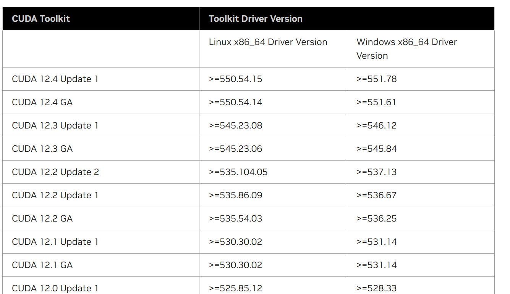

    ​	之后进入[pytorch官网](https://pytorch.org/)，在下方选择自己需要的cuda版本，复制命令并运行。
    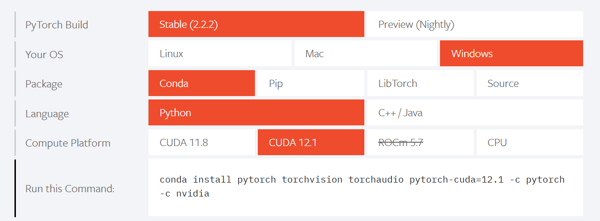

    验证是否可以使用gpu：
    	可在当前目录下新建python文件运行：`ChatGLM3\pre_cuda.py`

    ```python
    import torch
    print(torch.__version__)  # 查看torch当前版本号
    print(torch.version.cuda)  # 编译当前版本的torch使用的cuda版本号
    print(torch.cuda.is_available())  # 查看当前cuda是否可用于当前版本的Torch，如果输出True，则表示可用
    ```

    如果最后为True，说明大功告成。

  * 安装其余依赖：
    因为pytorch已经安装好，需要在官方requirements.txt中将torch一行删除。
    之后`pip install -r requirements.txt`即可。

## 2.微调原理讲解：

* 微调步骤：输入数据-->计算损失-->反向传播-->更新权重**。
  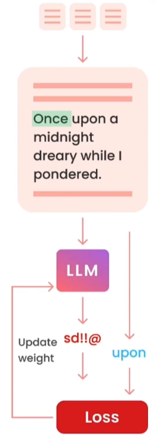

* 参数设置：
  max_steps设置8500。An epoch isapass overyouramntire dataset。
  **一个epoch是对整个数据集的一次遍历**，可能需要多次迭代整个数据集。
  分批加载，在将数据进行标记化时看到的不同**batch**，通过不同的**batch**将数据集集合在一起。

* 微调简介：

  **定义：**
  如何采用开源大语言模型（LLM），并且在我们自己的数据上进一步训练
  **作用：**
  使得LLM更加稳定的执行我们想要进行的操作，目的更强，构建自己的私有的数据问答模型 。将**通用模型**，比如GPT-3，专门用于像ChatGpT这样的**特定用途**，也就是说，可以**定制一个属于专门领域的专用模型**
  **如何进行：**
  1.准备数据（preparing the data ）
  2.训练模型（trainin the model）
  3.评估模型（evaluating ）

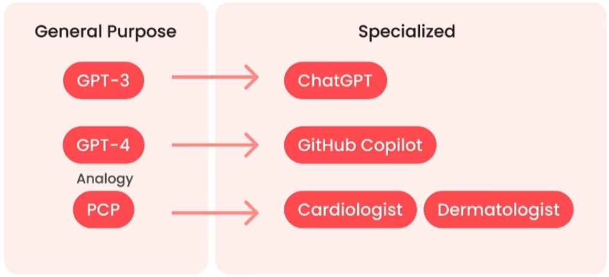

* 举例：
  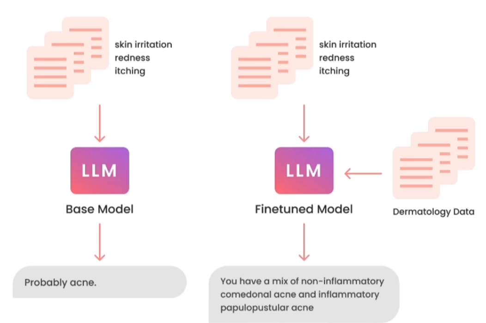
  微调作用：**模型可以从该数据中进行学习，而不仅仅是访问该数据**
* **prompting 和finetuning对比**
  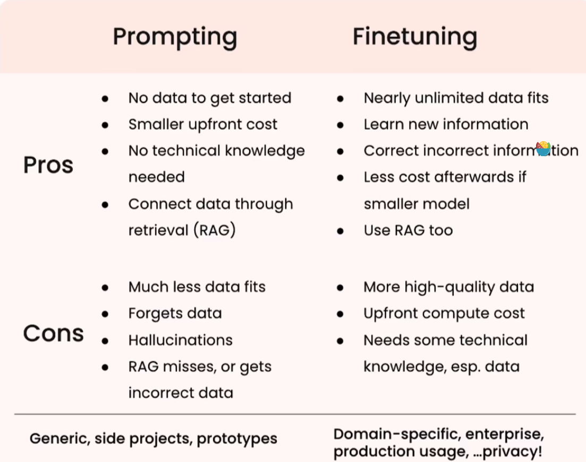
  **prompting：**适合应用于辅助功能和项目的雏形
  **微调：**适用于企业或特定领域的场景，是面向真实生产的，防止胡言乱语

## 3.LORA原理：

大模型要解决的问题，就是一个序列数据转换的问题：
**输入序列 X = [x1, x2, ..., xm]， 输出序列Y = [y1, y2, …, yn]，X和Y之间的关系是：Y = WX。**

* PEFT参数高效微调介绍：
  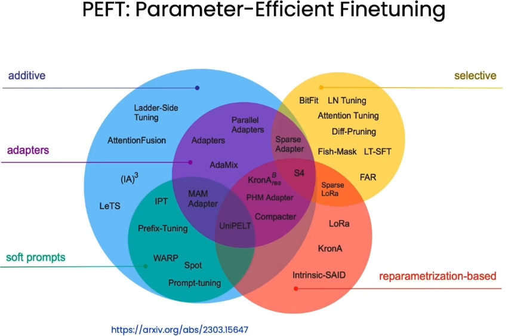

* **LORA的作用：**
  **大幅度减少模型需要训练的参数数量，也就是模型的权重数量**
  更少的训练参数数量（Fewer trainable parameters）
  更少的GPU内存占用（Less GPU memory）
  微调后准确率稍微低一点（Slightly below accuracy to finetuning）
  相同的推理延迟（Same inference latency）

* **原理：**
  冻结模型中的主要预训练权重
  在模型的某些层中训练新的权重
  推理时合并权重

  LoRA的假设前提：大语言模型被过度参数化的。但是大模型存在有一个**低维的本质模型**。大模型参数很多，但并不是所有的参数都是发挥同样作用的；其中一部分参数，是非常重要的，是影响大模型生成结果的关键参数（**低维的本质模型**）

* **步骤：**
  1.为了我们需要的特定模型，将Y=WX变成Y=(W+∆W)X，这里面∆W主是我们要微调得到的结果；
  2.其次，将∆W进行低维分解∆W=AB (∆W为m * n维，A为m * r维，B为r * n维，r就是上述假设中的低维)；
  3.用特定的训练数据，训练出A和B即可得到∆W，在推理的过程中直接将∆W加到W上去，再没有额外的成本。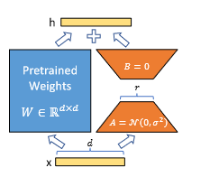

**关于LoRA的具体细节，可以参见[LoRA: Low-Rank Adaptation of Large Language Models](https://arxiv.org/pdf/2106.09685.pdf)**

* LORA优点：
  1.一个预训练好的模型可以被共享，用于为不同的任务构建许多小的LoRA模块。通过替换矩阵A和B，我们可以冻结共享模型并高效地切换任务，显著降低了存储需求和任务切换开销。
  2，LoRA使得训练更加高效，在使用自适应优化器时，由于不需要对大多数参数进行梯度计算或保持优化器状态，**硬件加速最多降低了3倍**。
  3.简单线性设计允许在部署大模型时将可训练矩阵与冻结权重合并，与完全微调的模型相比，没有引入推理延迟。

## 4.微调实操：

* 首先配置环境 在`finetune_demo `中安装依赖。
  文件位置：`ChatGLM3\finetune_demo\requirements.txt`
  使用<kbd>pip install -r requirements.txt</kbd>即可。

* 数据处理部分：
  官方的[微调教程连接](https://github.com/THUDM/ChatGLM3/blob/main/finetune_demo/lora_finetune.ipynb)。
  
  微调模型的对话能力的数据格式：
  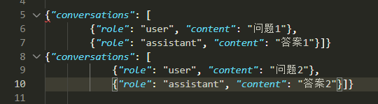
  为此我们使用了py代码将数据集转换为适合当前模型微调的格式。
  对应代码在`solve_data`目录下。
  
  处理完数据之后，记住数据存放路径，之后微调时需要路径。

* 微调启动：
  官方提供的微调命令：

  ```python
  python finetune_hf.py 'D:\\Users\\gxy\\every_thing\\project\\vs_chatglm\\ChatGLM3\\finetune_demo\\data\\AdvertiseGen_fix' 'D:\\Users\\gxy\\every_thing\\project\\vs_chatglm\\ChatGLM3\\models\\chatglm3-6b' 'D:\\Users\\gxy\\every_thing\\project\\vs_chatglm\\ChatGLM3\\finetune_demo\\configs\\lora.yaml'
  ```

  第一个参数是微调数据集，第二个参数是微调的底座模型，第三个参数是lora.yaml文件，也是最重要的，存储有关配置众多参数的文件。

* `lora.yaml`文件中设置了训练之后的loRA权重的输出文件，这里选择：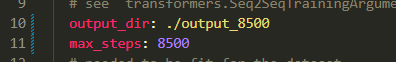

  训练之后可以看到，最后得到：
  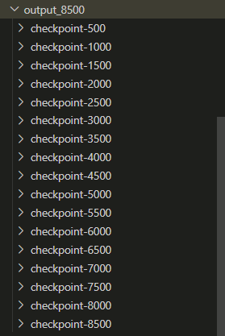

* 微调之后我们可以进行问题的询问：（具体的gradio部署将在之后描述）
  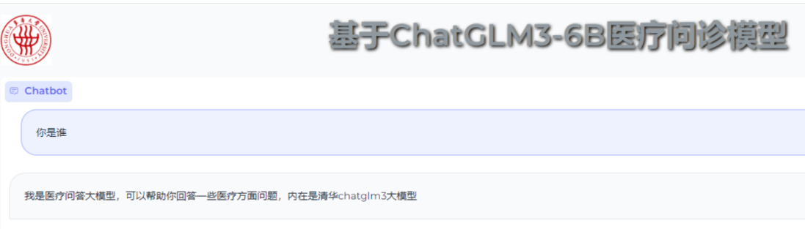这里能够看到微调是成功的。

## 5.合并微调之前模型参数和新的权重：

* 微调之后新的权重记录在output目录下，官方只提供了在原先模型的基础上，通过`adapter_config.json`中记录了微调型的路径，运行之后再加载。
  实际上这只是把两部分分开存储，并不是把两部分合并在一起，
  官方提供的加载新的权重的代码：

```python
def load_model_and_tokenizer(model_dir: Union[str, Path]) -> tuple[ModelType, TokenizerType]:
    model_dir = _resolve_path(model_dir)
    if (model_dir / 'adapter_config.json').exists():
        model = AutoPeftModelForCausalLM.from_pretrained(
            model_dir, trust_remote_code=True, device_map='auto'
        )
        tokenizer_dir = model.peft_config['default'].base_model_name_or_path
    else:
        model = AutoModelForCausalLM.from_pretrained(
            model_dir, trust_remote_code=True, device_map='auto'
        )
        tokenizer_dir = model_dir
    tokenizer = AutoTokenizer.from_pretrained(
        tokenizer_dir, trust_remote_code=True
    )
    return model, tokenizer
```

* 在上面代码基础上，我们写了新的代码，将原先的权重和新的模型的代码合并。

  ```python
  @app.command()
  def main(
          model_dir: Annotated[str, typer.Argument(help='')],
          out_dir: Annotated[str, typer.Option(help='')],
  ):
      model, tokenizer = load_model_and_tokenizer(model_dir)
      
      merged_model = model.merge_and_unload()
      merged_model.save_pretrained(out_dir, safe_serialization=True)
      tokenizer.save_pretrained(out_dir)
  
  if __name__ == '__main__':
      app()
  ```

* 合并代码的使用：
  合并代码在使用时需要传递两个参数，第一个为待合并模型，（因为lora权重文件下方又adapter_config.json包含了底座模型的位置），第二个为合并之后的模型位置。
  举例：

  ```python 
  python other\MERGE\main.py output_8500\checkpoint-8500 	ChatGLM3\models\chatglm3_ER8500
  ```

  结果如下图：
  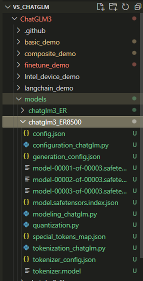

## 6.部署gradio、web_demo：

* 在`basic_demo`目录下的`web_demo_gradio.py`文件中，提供了官方给的部署gradio代码。
  对应的依赖在`ChatGLM3\requirements.txt`中已经下载过。
* 需要修改新的模型路径，因为在`web_demo_gradio.py`文件中，提供了加载模型和标识器的函数，所以加载lora权重也是可以的。
  这里我们选择使用合并之后的模型进行部署：
  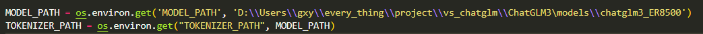

* 部署web_demo:
  对应代码文件在`ChatGLM3\composite_demo`目录下面，首先需要下载`ChatGLM3\composite_demo\requirements.txt`依赖项。
* 在web_demo模块，对应的模型参数路径在`ChatGLM3\composite_demo\client.py`文件下存储：
  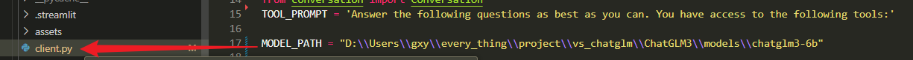

* 因为在此文件下官方没有提供`load_model_and_tokenizer()`函数，所以当前模块不能直接使用lora权重文件进行加载，需要按照上文提过的合并方法，将原模型和权重模型合并之后再进行加载。

## 踩过的坑

* 下载模型时因模型参数太大，没有git clone成功：
  推荐使用`git lfs`命令,第一次下载时，模型参数没有git clone全部完成。之后研究了git lfs 下载成功。
  也可以`git clone`之后在[ModelScope链接](https://modelscope.cn/models/ZhipuAI/chatglm3-6b/files)中对比，将没有下载好的单独重新下载。
* huggingface_hub版本问题：
  官方要求huging_face版本为：`huggingface_hub>=0.19.4`。
  建议直接下载0.19.4版本，不要用高版本，不然在`ChatGLM3\composite_demo\client.py`中会出错。（这个bug卡了我很久很久😭）

* 建议在微调之前，可以先借用官方提供的教程`ChatGLM3\finetune_demo\lora_finetune.ipynb`，在尝试成功、理清楚每一步的思路之后，开始自己的微调，不然可能微调一天最后发现有bug,都要从头来过。
